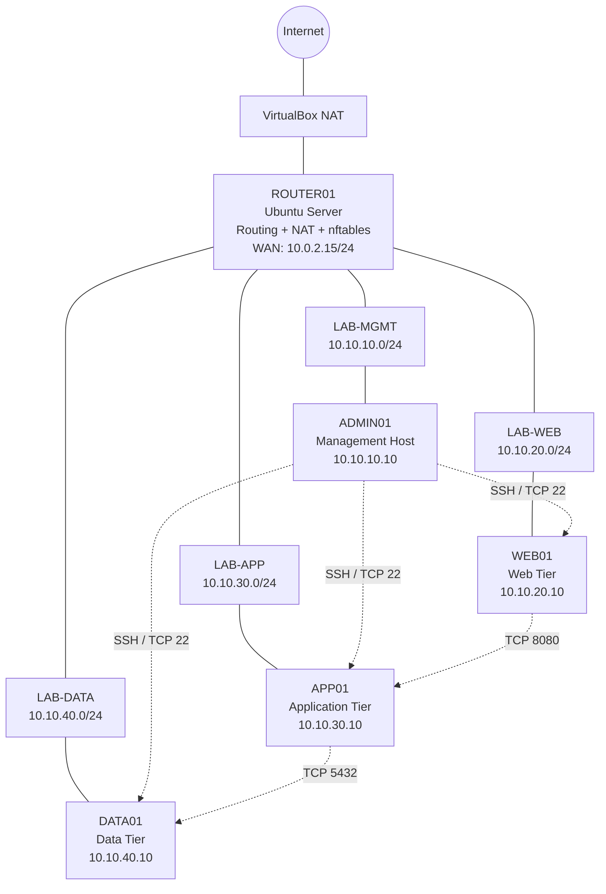

# Network Security Lab Architecture

## Logical Architecture



## Network Segments

| Zone | Subnet | Gateway | Workload |
|---|---|---|---|
| Management | 10.10.10.0/24 | 10.10.10.1 | ADMIN01 |
| Web | 10.10.20.0/24 | 10.10.20.1 | WEB01 |
| Application | 10.10.30.0/24 | 10.10.30.1 | APP01 |
| Data | 10.10.40.0/24 | 10.10.40.1 | DATA01 |

## Authorized Inter-Zone Flows

```text
ADMIN01 ── TCP/22 ──> WEB01
ADMIN01 ── TCP/22 ──> APP01
ADMIN01 ── TCP/22 ──> DATA01

WEB01   ── TCP/8080 ──> APP01
APP01   ── TCP/5432 ──> DATA01
```

All other new inter-zone connections are denied unless explicitly authorized by the ROUTER01 nftables forwarding policy.

Established and related return traffic is permitted through stateful connection tracking.

## Traffic Enforcement

ROUTER01 is the centralized routing and filtering point between the four internal networks.

Its forwarding policy follows the model:

```text
DEFAULT DENY
     +
EXPLICIT ALLOW RULES
     +
STATEFUL RETURN TRAFFIC
```

Internet-bound traffic from the internal `10.10.0.0/16` address space is currently permitted through ROUTER01 and translated using source NAT.

## Azure Conceptual Mapping

The architecture demonstrates concepts relevant to:

- Azure Virtual Network address planning;
- subnet segmentation;
- Network Security Group rule design;
- Network Virtual Appliance concepts;
- stateful network filtering;
- routing;
- controlled administrative access;
- multi-tier application isolation.

The VirtualBox networks and nftables implementation are local equivalents used for learning underlying networking concepts. They are not Azure services and should not be interpreted as an actual Azure deployment.